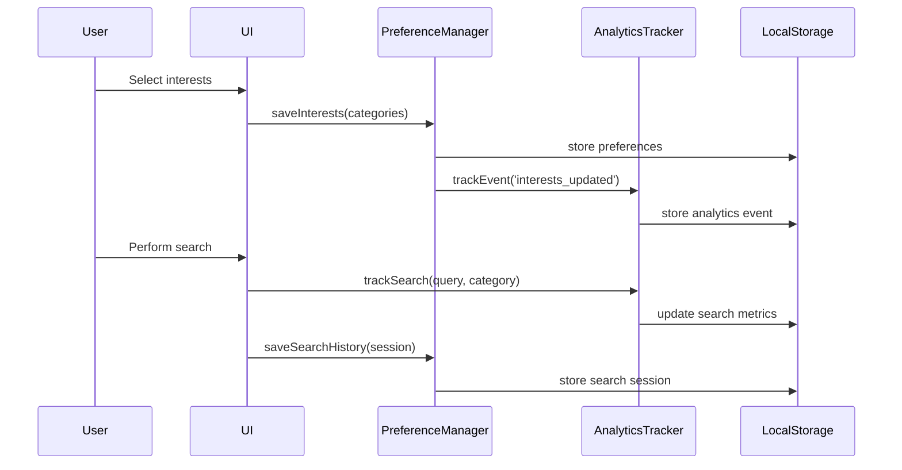

# User Personalization System Design

## Overview

The User Personalization System extends FrugalAIGpt with comprehensive customization capabilities, enabling users to tailor their experience through interest-based content discovery, search history management, preference configuration, and usage analytics. The system uses browser localStorage for data persistence, requiring no backend authentication or database infrastructure for the MVP.

## Architecture

### High-Level Architecture

```
┌─────────────────────────────────────────────────────────────┐
│                     FrugalAIGpt Frontend                         │
├─────────────────────────────────────────────────────────────┤
│                                                               │
│  ┌──────────────┐  ┌──────────────┐  ┌──────────────┐      │
│  │  Discovery   │  │   Chat UI    │  │  Analytics   │      │
│  │    Page      │  │              │  │  Dashboard   │      │
│  └──────┬───────┘  └──────┬───────┘  └──────┬───────┘      │
│         │                  │                  │              │
│         └──────────────────┼──────────────────┘              │
│                            │                                 │
│                   ┌────────▼────────┐                        │
│                   │  Preference     │                        │
│                   │  Manager        │                        │
│                   │  Service        │                        │
│                   └────────┬────────┘                        │
│                            │                                 │
│                   ┌────────▼────────┐                        │
│                   │  Analytics      │                        │
│                   │  Tracker        │                        │
│                   └────────┬────────┘                        │
│                            │                                 │
│                   ┌────────▼────────┐                        │
│                   │  localStorage   │                        │
│                   │  (Browser)      │                        │
│                   └─────────────────┘                        │
└─────────────────────────────────────────────────────────────┘
```

### Component Interaction Flow



## Components and Interfaces

### 1. Preference Manager Service

**Location:** `src/lib/preferences/preferenceManager.ts`

**Purpose:** Centralized service for managing all user preferences and settings

**Interface:**
```typescript
interface UserPreferences {
  interests: {
    categories: string[];
    allTopicsMode: boolean;
  };
  searchHistory: SearchSession[];
  favorites: string[]; // session IDs
  searchPreferences: {
    defaultMode: 'all' | 'academic' | 'writing' | 'youtube' | 'reddit' | 'wolfram';
    enabledSources: {
      images: boolean;
      videos: boolean;
      academic: boolean;
      reddit: boolean;
      wolframAlpha: boolean;
    };
    resultsDensity: 'compact' | 'standard' | 'detailed';
  };
}

interface SearchSession {
  id: string;
  title: string;
  timestamp: number;
  messages: Message[];
  category?: string;
  isFavorite: boolean;
}

class PreferenceManager {
  // Interest management
  getInterests(): string[];
  setInterests(categories: string[]): void;
  isAllTopicsMode(): boolean;
  setAllTopicsMode(enabled: boolean): void;
  
  // Search history
  getSearchHistory(limit?: number): SearchSession[];
  saveSearchSession(session: SearchSession): void;
  getSearchSession(id: string): SearchSession | null;
  deleteSearchSession(id: string): void;
  clearSearchHistory(): void;
  searchHistory(query: string): SearchSession[];
  
  // Favorites
  getFavorites(): SearchSession[];
  toggleFavorite(sessionId: string): void;
  isFavorite(sessionId: string): boolean;
  
  // Search preferences
  getSearchPreferences(): SearchPreferences;
  setDefaultSearchMode(mode: string): void;
  toggleSearchSource(source: string, enabled: boolean): void;
  setResultsDensity(density: string): void;
  
  // Utility
  exportPreferences(): string; // JSON export
  importPreferences(data: string): void;
  clearAllData(): void;
}
```

### 2. Analytics Tracker

**Location:** `src/lib/analytics/analyticsTracker.ts`

**Purpose:** Track user activity and generate usage insights

**Interface:**
```typescript
interface AnalyticsData {
  searches: {
    total: number;
    byCategory: Record<string, number>;
    byDate: Record<string, number>; // ISO date string -> count
  };
  features: {
    imagesUsed: number;
    videosUsed: number;
    academicUsed: number;
    redditUsed: number;
    wolframUsed: number;
  };
  modelUsage: {
    tier1: number; // granite-3.1-2b
    tier2: number; // granite-3.1-8b
    tier3: number; // llama-3.3-70b
  };
  sessions: {
    totalSessions: number;
    averageQueriesPerSession: number;
  };
  lastUpdated: number;
}

interface UsageInsights {
  topCategories: Array<{ category: string; count: number }>;
  mostUsedFeatures: Array<{ feature: string; count: number }>;
  weeklySearches: number;
  monthlySearches: number;
  estimatedCostSavings: number; // based on frugal routing
  activityTrend: 'increasing' | 'stable' | 'decreasing';
}

class AnalyticsTracker {
  // Event tracking
  trackSearch(query: string, category?: string): void;
  trackFeatureUse(feature: string): void;
  trackModelUse(tier: number): void;
  trackSessionStart(): void;
  trackSessionEnd(): void;
  
  // Data retrieval
  getAnalyticsData(): AnalyticsData;
  getInsights(): UsageInsights;
  getSearchesByDateRange(startDate: Date, endDate: Date): number;
  
  // Export
  exportAnalytics(): string; // JSON export
  
  // Maintenance
  pruneOldData(daysToKeep: number): void;
}
```

### 3. Interest Categories Configuration

**Location:** `src/lib/preferences/interestCategories.ts`

**Purpose:** Define available interest categories and their search keywords

**Interface:**
```typescript
interface InterestCategory {
  id: string;
  name: string;
  icon: string; // Lucide icon name
  keywords: string[]; // Search terms for this category
  color: string; // Tailwind color class
}

const INTEREST_CATEGORIES: InterestCategory[] = [
  {
    id: 'tech',
    name: 'Tech & Science',
    icon: 'Cpu',
    keywords: ['technology', 'AI', 'science', 'innovation', 'tech news'],
    color: 'blue'
  },
  {
    id: 'finance',
    name: 'Finance',
    icon: 'DollarSign',
    keywords: ['finance', 'markets', 'stocks', 'economy', 'business'],
    color: 'green'
  },
  {
    id: 'sports',
    name: 'Sports',
    icon: 'Trophy',
    keywords: ['sports', 'football', 'basketball', 'soccer', 'athletics'],
    color: 'orange'
  },
  {
    id: 'health',
    name: 'Health & Wellness',
    icon: 'Heart',
    keywords: ['health', 'wellness', 'fitness', 'medical', 'nutrition'],
    color: 'red'
  },
  {
    id: 'entertainment',
    name: 'Entertainment',
    icon: 'Film',
    keywords: ['entertainment', 'movies', 'music', 'celebrities', 'TV'],
    color: 'purple'
  },
  {
    id: 'art',
    name: 'Art & Culture',
    icon: 'Palette',
    keywords: ['art', 'culture', 'museums', 'design', 'creativity'],
    color: 'pink'
  },
  {
    id: 'politics',
    name: 'Politics & World',
    icon: 'Globe',
    keywords: ['politics', 'world news', 'government', 'international'],
    color: 'indigo'
  },
  {
    id: 'business',
    name: 'Business',
    icon: 'Briefcase',
    keywords: ['business', 'startups', 'entrepreneurship', 'companies'],
    color: 'yellow'
  }
];
```

### 4. UI Components

#### Interest Selector Modal
**Location:** `src/components/Preferences/InterestSelector.tsx`

- Modal dialog for selecting interests
- Grid layout with category cards
- Multi-select with visual feedback
- "All Topics" toggle option
- Save and cancel actions

#### History Sidebar
**Location:** `src/components/History/HistorySidebar.tsx`

- Collapsible sidebar panel
- List of recent search sessions
- Search/filter functionality
- Favorite toggle per session
- Delete individual sessions
- Clear all history action

#### Preferences Panel
**Location:** `src/components/Preferences/PreferencesPanel.tsx`

- Settings page or modal
- Tabbed interface for different preference categories
- Search preferences section
- Interest management
- Data export/import
- Clear data options

#### Analytics Dashboard
**Location:** `src/components/Analytics/AnalyticsDashboard.tsx`

- Dedicated page at `/analytics`
- Summary cards for key metrics
- Charts for trends (using recharts library)
- Category breakdown
- Feature usage statistics
- Cost savings calculator
- Export analytics button

## Data Models

### LocalStorage Schema

```typescript
// Key: 'frugalaigpt_preferences'
{
  version: '1.0',
  interests: {
    categories: string[],
    allTopicsMode: boolean
  },
  searchPreferences: {
    defaultMode: string,
    enabledSources: Record<string, boolean>,
    resultsDensity: string
  }
}

// Key: 'frugalaigpt_search_history'
{
  version: '1.0',
  sessions: SearchSession[], // max 100 entries
  favorites: string[] // session IDs
}

// Key: 'frugalaigpt_analytics'
{
  version: '1.0',
  searches: {
    total: number,
    byCategory: Record<string, number>,
    byDate: Record<string, number>
  },
  features: Record<string, number>,
  modelUsage: Record<string, number>,
  sessions: {
    totalSessions: number,
    averageQueriesPerSession: number
  },
  lastUpdated: number
}
```

### Storage Size Management

- Maximum 100 search sessions stored
- Analytics data pruned after 90 days
- Implement compression for large data structures
- Warning when approaching localStorage limits (5-10MB)
- Graceful degradation if storage is full

## Integration Points

### 1. Discovery Page Integration

**File:** `src/app/discover/page.tsx`

**Changes:**
- Check user interests on page load
- Show interest selector modal if no interests set
- Filter API calls based on selected categories
- Display active interest chips
- Add "All Topics" toggle

**API Modification:** `src/app/api/discover/route.ts`
- Accept `categories` parameter
- Modify search queries to include category keywords
- Return category-specific results

### 2. Chat Interface Integration

**File:** `src/components/ChatWindow.tsx`

**Changes:**
- Auto-save conversations to search history
- Apply search preferences (default mode, enabled sources)
- Track analytics events on search
- Add history sidebar toggle button
- Restore conversations from history

### 3. Settings Integration

**New Route:** `src/app/settings/page.tsx`

**Features:**
- Preferences panel component
- Interest management
- Search preferences configuration
- Data management (export, import, clear)

### 4. Analytics Dashboard

**New Route:** `src/app/analytics/page.tsx`

**Features:**
- Display analytics dashboard component
- Real-time metrics
- Charts and visualizations
- Export functionality

## Error Handling

### LocalStorage Failures

1. **Storage Full:**
   - Detect quota exceeded errors
   - Prompt user to clear old data
   - Automatically prune oldest sessions
   - Show warning notification

2. **Corrupted Data:**
   - Validate data structure on read
   - Fallback to defaults if invalid
   - Log errors to console
   - Offer data reset option

3. **Browser Compatibility:**
   - Check localStorage availability
   - Graceful degradation to session-only mode
   - Display warning if persistence unavailable

### Data Migration

- Version field in each storage key
- Migration functions for schema changes
- Backward compatibility for older versions
- Safe fallback to defaults if migration fails

## Testing Strategy

### Unit Tests

1. **PreferenceManager Tests:**
   - Test all CRUD operations
   - Verify localStorage interactions
   - Test data validation
   - Test export/import functionality

2. **AnalyticsTracker Tests:**
   - Test event tracking
   - Verify metric calculations
   - Test insights generation
   - Test data pruning

3. **Component Tests:**
   - Test interest selector interactions
   - Test history sidebar functionality
   - Test preferences panel
   - Test analytics dashboard rendering

### Integration Tests

1. **End-to-End Flows:**
   - Complete onboarding flow
   - Search and save session flow
   - Modify preferences and verify behavior
   - View analytics after activity

2. **Storage Tests:**
   - Test storage limits
   - Test data persistence across page reloads
   - Test concurrent tab behavior
   - Test storage cleanup

### Manual Testing Checklist

- [ ] First-time user sees interest selector
- [ ] Selected interests persist after reload
- [ ] Discovery page shows category-filtered content
- [ ] Search sessions are automatically saved
- [ ] History sidebar displays recent searches
- [ ] Favorites can be toggled and persist
- [ ] Search preferences affect default behavior
- [ ] Analytics dashboard shows accurate metrics
- [ ] Export/import works correctly
- [ ] Clear data removes all stored information
- [ ] Storage full scenario handled gracefully

## Performance Considerations

1. **Lazy Loading:**
   - Load search history on demand
   - Paginate history list for large datasets
   - Defer analytics calculations until dashboard viewed

2. **Debouncing:**
   - Debounce analytics tracking writes
   - Batch multiple events before writing to storage

3. **Caching:**
   - Cache preferences in memory after first load
   - Only write to localStorage on changes
   - Use React Context for global preference access

4. **Optimization:**
   - Minimize localStorage read/write operations
   - Use efficient data structures
   - Compress large data before storage
   - Index search history for fast lookups

## Security & Privacy

1. **Data Privacy:**
   - All data stored locally in browser
   - No server-side storage or transmission
   - User has full control over data
   - Clear data option available

2. **Data Sanitization:**
   - Validate all input before storage
   - Sanitize user-generated content
   - Prevent XSS in stored data

3. **Storage Isolation:**
   - Use unique key prefixes
   - Avoid conflicts with other apps
   - Handle multiple tabs gracefully

## Future Enhancements

1. **Cloud Sync (Optional):**
   - Backend API for preference sync
   - User authentication
   - Cross-device synchronization

2. **Advanced Analytics:**
   - Machine learning for usage predictions
   - Personalized recommendations
   - A/B testing framework

3. **Social Features:**
   - Share favorite searches
   - Collaborative collections
   - Community insights

4. **Export Formats:**
   - PDF export for search history
   - Markdown export for notes
   - CSV export for analytics
