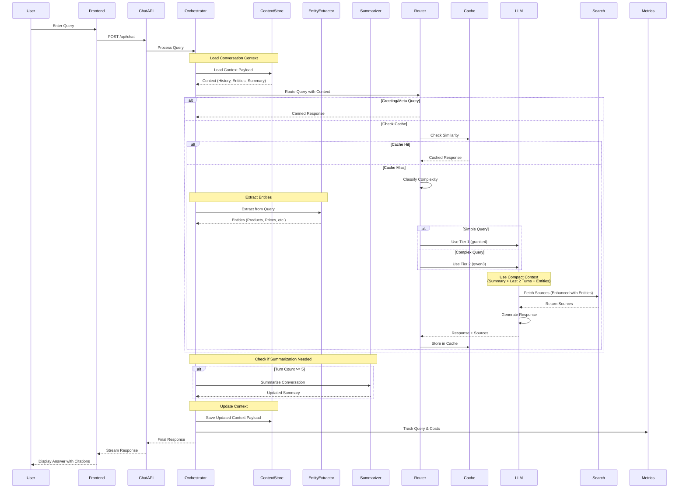
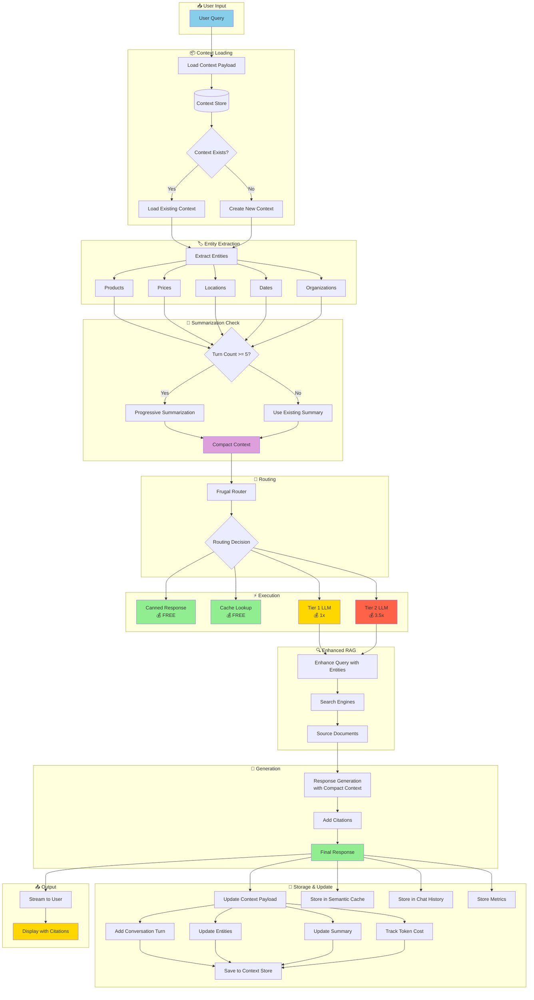
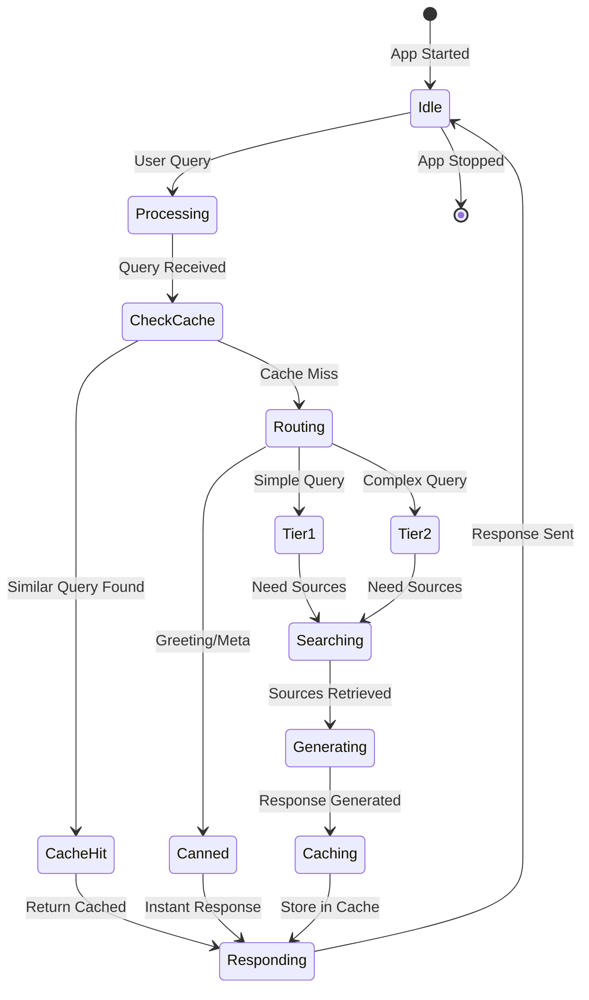
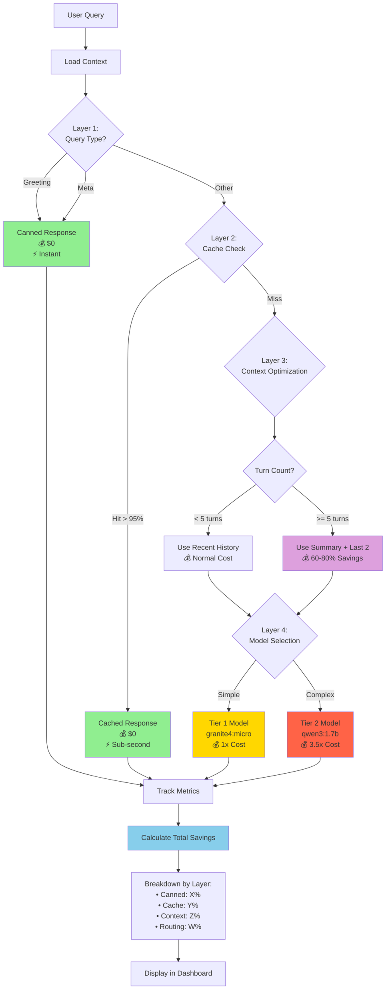

# 🏗️ FrugalAIGpt Complete Architecture

Comprehensive architecture diagrams showing all components, flows, and interactions.

## 📊 Complete System Architecture

```mermaid
graph TB
    subgraph "🚀 Startup Layer"
        StartScript[Startup Scripts<br/>startup.sh / startup-dev.sh / startup.bat]
        StartScript --> CheckPrereq[Check Prerequisites]
        CheckPrereq --> CheckPort[Check Port 3000]
        CheckPort --> StartOllama[Start Ollama]
        StartOllama --> PullModels[Pull AI Models]
        PullModels --> StartServices[Start Services]
    end
    
    subgraph "🐳 Infrastructure Layer"
        StartServices --> Docker[Docker Compose]
        StartServices --> DevServer[Next.js Dev Server]
        
        Docker --> SearxNG[SearxNG Container<br/>Port 4000]
        Docker --> AppContainer[App Container<br/>Port 3000]
        
        DevServer --> LocalApp[Local App<br/>Port 3000]
    end
    
    subgraph "🌐 Frontend Layer - Port 3000"
        AppContainer --> Frontend
        LocalApp --> Frontend
        
        Frontend[Next.js Frontend]
        Frontend --> ChatUI[Chat Interface]
        Frontend --> DiscoveryUI[Discovery Feed]
        Frontend --> MetricsUI[Metrics Dashboard]
        Frontend --> AnalyticsUI[Analytics Page]
        Frontend --> SettingsUI[Settings Panel]
    end
    
    subgraph "🔌 API Layer"
        ChatUI --> ChatAPI[/api/chat]
        DiscoveryUI --> DiscoverAPI[/api/discover]
        MetricsUI --> MetricsAPI[/api/metrics]
        ChatUI --> ImagesAPI[/api/images]
        ChatUI --> VideosAPI[/api/videos]
    end
    
    subgraph "🧠 Stateful Orchestration Layer"
        ChatAPI --> Orchestrator[Stateful Orchestrator]
        
        Orchestrator --> LoadContext[Load Context Payload]
        LoadContext --> ContextStore[Context Store<br/>In-Memory TTL]
        
        Orchestrator --> Router[Frugal Router]
        Orchestrator --> CacheLayer[Semantic Cache]
        
        Orchestrator --> EntityExtractor[Entity Extractor<br/>Products, Prices, Locations]
        EntityExtractor --> TrackEntities[Track Entities]
        
        Orchestrator --> ConvSummarizer[Conversation Summarizer<br/>Every 5 Turns]
        ConvSummarizer --> UpdateSummary[Update Summary]
        
        TrackEntities --> SaveContext[Save Context Payload]
        UpdateSummary --> SaveContext
        SaveContext --> ContextStore
    end
    
    subgraph "🎯 Routing Decision"
        Router --> Classify{Query Classification}
        Classify -->|Greeting/Meta| Canned[Canned Response<br/>💰 FREE]
        Classify -->|Check Cache| CacheCheck{Cache Hit?}
        CacheCheck -->|Yes| CacheHit[Cached Response<br/>💰 FREE]
        CacheCheck -->|No| ComplexityCheck{Query Complexity?}
        ComplexityCheck -->|Simple| Tier1[Tier 1 Model<br/>granite4:micro<br/>💰 1x Cost]
        ComplexityCheck -->|Complex| Tier2[Tier 2 Model<br/>qwen3:1.7b<br/>💰 3.5x Cost]
    end
    
    subgraph "🔍 RAG Pipeline"
        Tier1 --> RAG[RAG Service]
        Tier2 --> RAG
        RAG --> SearchRouter{Search Router}
        SearchRouter --> WebSearch[Web Search]
        SearchRouter --> ImageSearch[Image Search]
        SearchRouter --> VideoSearch[Video Search]
        SearchRouter --> AcademicSearch[Academic Search]
    end
    
    subgraph "🌍 External Services"
        WebSearch --> Serper[Serper.dev API]
        WebSearch --> DDG[DuckDuckGo]
        WebSearch --> SearxNG
        ImageSearch --> Serper
        VideoSearch --> Serper
        AcademicSearch --> Serper
        
        DiscoverAPI --> NewsAPI[News APIs]
    end
    
    subgraph "🤖 LLM Layer"
        Tier1 --> OllamaService[Ollama Service<br/>Port 11434]
        Tier2 --> OllamaService
        OllamaService --> Models[AI Models<br/>granite4:micro<br/>qwen3:1.7b]
    end
    
    subgraph "💾 Data Layer"
        ContextStore --> SQLite[(SQLite Database<br/>./data/app.db)]
        CacheLayer --> VectorDB[(Vector Cache<br/>In-Memory)]
        ChatAPI --> ChatStore[(Chat History<br/>SQLite)]
        Frontend --> LocalStorage[(Browser Storage<br/>Preferences)]
    end
    
    subgraph "📊 Monitoring Layer"
        Orchestrator --> MetricsTracker[Metrics Tracker]
        MetricsTracker --> MetricsStore[(Metrics Data)]
        MetricsAPI --> MetricsStore
        
        Router --> CostTracker[Cost Tracker]
        CostTracker --> MetricsStore
    end
    
    subgraph "🔄 Reset Functionality"
        ResetScript[startup.sh --reset]
        ResetScript --> StopContainers[Stop Containers]
        ResetScript --> ClearVolumes[Clear Volumes]
        ResetScript --> ClearDB[Clear Database]
        ResetScript --> FreePort[Free Port 3000]
    end
    
    style Canned fill:#90EE90
    style CacheHit fill:#90EE90
    style Tier1 fill:#FFD700
    style Tier2 fill:#FF6347
    style Frontend fill:#87CEEB
    style OllamaService fill:#DDA0DD
    style MetricsTracker fill:#F0E68C
```

## 🔄 Request Flow Diagram (With Stateful Orchestration)



## 🚀 Startup Flow Diagram

```mermaid
flowchart TD
    Start([User Runs Startup Script]) --> OS{Operating System?}
    
    OS -->|Linux/Mac| CheckScript[./startup.sh or<br/>./startup-dev.sh]
    OS -->|Windows| CheckScriptWin[startup.bat]
    
    CheckScript --> ResetCheck{--reset flag?}
    CheckScriptWin --> ResetCheck
    
    ResetCheck -->|Yes| ResetFlow[Reset Application]
    ResetFlow --> StopAll[Stop All Services]
    StopAll --> ClearData[Clear All Data]
    ClearData --> FreePort[Free Port 3000]
    FreePort --> ExitReset([Exit - Ready for Fresh Start])
    
    ResetCheck -->|No| Prerequisites[Check Prerequisites]
    
    Prerequisites --> Docker{Docker Mode?}
    Docker -->|Yes| CheckDocker[Check Docker & Compose]
    Docker -->|No| CheckNode[Check Node.js & npm]
    
    CheckDocker --> PortCheck
    CheckNode --> PortCheck
    
    PortCheck{Port 3000<br/>Available?}
    PortCheck -->|No| AskFree{Ask User to<br/>Free Port?}
    AskFree -->|Yes| KillPort[Kill Process on Port]
    AskFree -->|No| ExitError([Exit with Error])
    KillPort --> ConfigCheck
    PortCheck -->|Yes| ConfigCheck
    
    ConfigCheck{config.toml<br/>Exists?}
    ConfigCheck -->|No| CopyConfig[Copy from sample.config.toml]
    ConfigCheck -->|Yes| OllamaCheck
    CopyConfig --> OllamaCheck
    
    OllamaCheck{Ollama<br/>Installed?}
    OllamaCheck -->|Yes| OllamaRunning{Ollama<br/>Running?}
    OllamaCheck -->|No| SkipOllama[Skip Ollama Setup]
    
    OllamaRunning -->|No| StartOllama[Start Ollama Service]
    OllamaRunning -->|Yes| CheckModels
    StartOllama --> CheckModels
    SkipOllama --> StartApp
    
    CheckModels[Check AI Models]
    CheckModels --> Model1{granite4:micro<br/>Exists?}
    Model1 -->|No| PullModel1[Pull granite4:micro]
    Model1 -->|Yes| Model2
    PullModel1 --> Model2
    
    Model2{qwen3:1.7b<br/>Exists?}
    Model2 -->|No| PullModel2[Pull qwen3:1.7b]
    Model2 -->|Yes| StartApp
    PullModel2 --> StartApp
    
    StartApp{Mode?}
    StartApp -->|Docker| BuildDocker[Build & Start Containers]
    StartApp -->|Dev| RunMigrations[Run DB Migrations]
    
    BuildDocker --> WaitReady[Wait for Services]
    RunMigrations --> StartDev[Start Dev Server]
    
    WaitReady --> HealthCheck{App Responding<br/>on Port 3000?}
    HealthCheck -->|No| Retry{Retry Count<br/>< 60?}
    Retry -->|Yes| WaitReady
    Retry -->|No| Timeout[Timeout Warning]
    HealthCheck -->|Yes| ShowStatus
    Timeout --> ShowStatus
    
    StartDev --> ShowStatus
    
    ShowStatus[Show Service Status]
    ShowStatus --> OpenBrowser[Open Browser]
    OpenBrowser --> ShowInfo[Display Info & Commands]
    ShowInfo --> AskLogs{View Logs?}
    
    AskLogs -->|Yes| StreamLogs[Stream Logs]
    AskLogs -->|No| Done([Done - App Running])
    StreamLogs --> Done
    
    style Start fill:#4CAF50
    style Done fill:#4CAF50
    style ExitError fill:#f44336
    style ExitReset fill:#FF9800
    style OpenBrowser fill:#2196F3
```



## 💾 Data Flow Diagram (With Context Management)



## 🔌 Port Architecture

```
┌─────────────────────────────────────────────────────┐
│                                                     │
│  🌐 Frontend Application                           │
│  Port: 3000 (Always)                               │
│  Access: http://localhost:3000                     │
│                                                     │
│  Routes:                                           │
│  • /              - Chat Interface                 │
│  • /discover      - Discovery Feed                 │
│  • /metrics       - Metrics Dashboard              │
│  • /analytics     - Analytics Page                 │
│  • /settings      - Settings Panel                 │
│  • /c/:id         - Conversation View              │
│                                                     │
└─────────────────────────────────────────────────────┘
                        ↓
┌─────────────────────────────────────────────────────┐
│                                                     │
│  🔌 API Endpoints (Same Port)                      │
│  Port: 3000                                        │
│                                                     │
│  • POST /api/chat        - Chat processing         │
│  • GET  /api/discover    - News feed               │
│  • GET  /api/metrics     - Metrics data            │
│  • POST /api/images      - Image search            │
│  • POST /api/videos      - Video search            │
│  • GET  /api/chats       - Chat list               │
│  • GET  /api/chats/:id   - Chat details            │
│  • GET  /api/models      - Available models        │
│                                                     │
└─────────────────────────────────────────────────────┘
                        ↓
┌─────────────────────────────────────────────────────┐
│                                                     │
│  🤖 Ollama Service                                 │
│  Port: 11434                                       │
│  Access: http://localhost:11434                    │
│                                                     │
│  Models:                                           │
│  • granite4:micro  - Tier 1 (Fast & Cheap)        │
│  • qwen3:1.7b      - Tier 2 (Smart & Powerful)    │
│                                                     │
└─────────────────────────────────────────────────────┘
                        ↓
┌─────────────────────────────────────────────────────┐
│                                                     │
│  🔍 SearxNG (Docker Only)                          │
│  Port: 4000                                        │
│  Access: http://localhost:4000                     │
│                                                     │
│  Optional meta-search engine                       │
│  (Serper.dev used by default)                      │
│                                                     │
└─────────────────────────────────────────────────────┘
```

## 📁 File System Architecture

```
FrugalAIGpt/
├── 🚀 Startup Scripts
│   ├── startup.sh              # Production (Linux/macOS)
│   ├── startup-dev.sh          # Development (Linux/macOS)
│   └── startup.bat             # Production (Windows)
│
├── 📝 Configuration
│   ├── config.toml             # Main config (API keys, settings)
│   ├── sample.config.toml      # Template config
│   ├── docker-compose.yaml     # Docker services
│   └── next.config.mjs         # Next.js config
│
├── 💾 Data (Generated)
│   ├── data/
│   │   └── app.db             # SQLite database
│   └── uploads/               # User uploads
│
├── 🎨 Frontend
│   └── src/
│       ├── app/               # Next.js pages
│       │   ├── page.tsx       # Chat interface
│       │   ├── discover/      # Discovery feed
│       │   ├── metrics/       # Metrics dashboard
│       │   ├── analytics/     # Analytics page
│       │   └── settings/      # Settings panel
│       │
│       ├── components/        # React components
│       │   ├── MessageBox.tsx
│       │   ├── CitationReferences.tsx
│       │   ├── ResponseBadges.tsx
│       │   └── ...
│       │
│       └── lib/              # Core logic
│           ├── orchestration/
│           │   ├── statefulOrchestrator.ts
│           │   └── orchestrationService.ts
│           ├── routing/
│           │   └── frugalRouter.ts
│           ├── cache/
│           │   └── semanticCache.ts
│           ├── context/
│           │   ├── conversationSummarizer.ts
│           │   ├── entityExtractor.ts
│           │   └── contextStore.ts
│           ├── models/
│           │   └── tierConfig.ts
│           └── metrics/
│               └── metricsTracker.ts
│
├── 📚 Documentation
│   ├── README.md
│   ├── QUICK_START.md
│   ├── STARTUP_GUIDE.md
│   ├── STARTUP_USAGE.md
│   ├── STARTUP_OPTIONS.md
│   ├── STARTUP_FLOW.md
│   ├── ARCHITECTURE_DIAGRAM.md
│   └── SCRIPTS_README.md
│
└── 🐳 Docker
    ├── app.dockerfile
    ├── entrypoint.sh
    └── searxng/
```

## 🔄 State Management



## 💰 Cost Optimization Flow (Multi-Layer)



## 📊 Cost Savings Breakdown

```
┌─────────────────────────────────────────────────────────────┐
│                                                             │
│  💰 Multi-Layer Cost Optimization                          │
│                                                             │
│  Layer 1: Query Type Routing                               │
│  ├─ Canned Responses: 10% of queries → 100% savings        │
│  └─ Savings: 10% of total cost                             │
│                                                             │
│  Layer 2: Semantic Caching                                 │
│  ├─ Cache Hits: 20-30% of queries → 100% savings           │
│  └─ Savings: 20-30% of total cost                          │
│                                                             │
│  Layer 3: Context Optimization (NEW!)                      │
│  ├─ Progressive Summarization: After 5 turns                │
│  ├─ Token Reduction: 60-80% in long conversations          │
│  └─ Savings: 15-25% of total cost                          │
│                                                             │
│  Layer 4: Model Tier Routing                               │
│  ├─ Tier 1 (90% of queries): 1x cost                       │
│  ├─ Tier 2 (10% of queries): 3.5x cost                     │
│  └─ Savings: 15-20% of total cost                          │
│                                                             │
│  ═══════════════════════════════════════════════════════   │
│  Total Savings: 60-80% vs. naive implementation            │
│                                                             │
└─────────────────────────────────────────────────────────────┘
```

---

**This architecture enables 60-80% cost savings while maintaining high-quality responses! 🚀**

**New in v2.0**: Stateful orchestration with entity tracking and progressive summarization adds an additional 15-25% savings in long conversations!

---
*Last updated: October 19, 2025*
