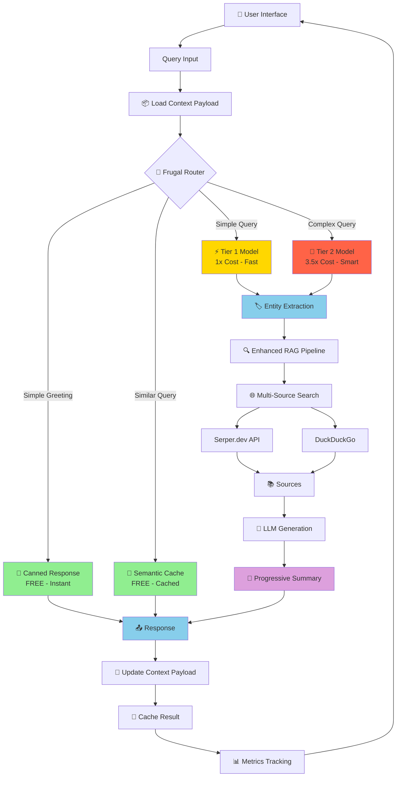

# 🚀 FrugalAIGpt - Cost-Optimized AI Search Engine

<div align="center">

**An intelligent AI-powered search engine with cost optimization, semantic caching, and tiered model architecture**

[](https://opensource.org/licenses/MIT)
[](https://www.docker.com/)

</div>

## 📋 Table of Contents

- [Overview](#overview)
- [Architecture](#architecture)
- [Features](#features)
- [Installation](#installation)
- [Configuration](#configuration)
- [Cost Optimization](#cost-optimization)
- [API Documentation](#api-documentation)
- [Contributing](#contributing)
- [License](#license)

## 🎯 Overview

FrugalAIGpt is an open-source, cost-optimized AI-powered search engine that combines intelligent query routing, semantic caching, stateful conversation management, and tiered model architecture to **reduce operational costs by 60-80%** while maintaining high-quality responses with grounded answers and verifiable citations.

### Key Highlights

- 💰 **60-80% Cost Reduction** through intelligent routing, caching, and context optimization
- 🧠 **Stateful Conversations** with entity tracking and progressive summarization
- ⚡ **Sub-second Response Times** with semantic caching
- 🎯 **Smart Query Routing** to appropriate model tiers
- 📊 **Real-time Metrics Dashboard** for monitoring performance
- 🔍 **Multi-Source Search** (Web, Images, Videos, Academic, Reddit)
- 🎨 **Modern UI** with gradient theming and responsive design
- 🔒 **Privacy-Focused** with local LLM support
- 🔗 **Clickable Citations** with source references

## 🏗️ Architecture

> **📊 For detailed architecture diagrams including startup flows, data flows, and complete system architecture, see [ARCHITECTURE_DIAGRAM.md](ARCHITECTURE_DIAGRAM.md)**

### System Flow Diagram



### Component Architecture

```
┌─────────────────────────────────────────────────────────────┐
│                     Frontend (Next.js)                       │
├─────────────────────────────────────────────────────────────┤
│  Chat UI  │  Discovery  │  Analytics  │  Settings  │  Metrics│
└─────────────────────────────────────────────────────────────┘
                              ↓
┌─────────────────────────────────────────────────────────────┐
│                    API Routes (Next.js)                      │
├─────────────────────────────────────────────────────────────┤
│  /api/chat  │  /api/discover  │  /api/images  │  /api/videos│
└─────────────────────────────────────────────────────────────┘
                              ↓
┌─────────────────────────────────────────────────────────────┐
│              Stateful Orchestration Service                  │
├─────────────────────────────────────────────────────────────┤
│  • Context Payload Management                               │
│  • Entity Extraction & Tracking                             │
│  • Progressive Summarization                                │
│  • Query Routing                                            │
│  • Cache Management                                         │
│  • Model Selection                                          │
│  • Metrics Tracking                                         │
└─────────────────────────────────────────────────────────────┘
                              ↓
        ┌─────────────────────┼─────────────────────┐
        ↓                     ↓                     ↓
┌──────────────┐    ┌──────────────┐    ┌──────────────┐
│ Frugal Router│    │Semantic Cache│    │  RAG Pipeline│
│              │    │              │    │              │
│ • Classify   │    │ • Vector DB  │    │ • Search     │
│ • Route      │    │ • Similarity │    │ • Retrieve   │
│ • Optimize   │    │ • LRU Evict  │    │ • Generate   │
└──────────────┘    └──────────────┘    └──────────────┘
                                                ↓
                                    ┌──────────────────┐
                                    │  Search Engines  │
                                    ├──────────────────┤
                                    │ • Serper.dev     │
                                    │ • DuckDuckGo     │
                                    │ • SearxNG        │
                                    └──────────────────┘
                                                ↓
                                    ┌──────────────────┐
                                    │   LLM Models     │
                                    ├──────────────────┤
                                    │ Tier 1: granite4 │
                                    │ Tier 2: qwen3    │
                                    │ (Ollama/OpenAI)  │
                                    └──────────────────┘
```

## ✨ Features

### 🎯 Core Features

#### 1. **Stateful Conversation Management** 🆕
- **Context Payload**: Maintains conversation state across multiple turns
- **Entity Extraction**: Automatically tracks products, prices, locations, dates, organizations
- **Progressive Summarization**: Reduces token costs by 60-80% in long conversations
- **Smart Context Windowing**: Only sends relevant context to LLM (summary + recent turns + entities)
- **Cost Tracking**: Real-time token counting and per-session cost calculation

#### 2. **Intelligent Query Routing**
- **Canned Responses**: Instant responses for greetings and meta-queries (FREE)
- **Semantic Cache**: Vector-based caching for similar queries (FREE after first query)
- **Tier 1 Models**: Fast, efficient models for simple queries (granite4:micro - 1x cost)
- **Tier 2 Models**: Powerful models for complex reasoning (qwen3:1.7b - 3.5x cost)

#### 3. **Multi-Source Search**
- **Web Search**: Powered by Serper.dev and DuckDuckGo
- **Image Search**: High-quality image results with thumbnails
- **Video Search**: YouTube video integration
- **Academic Search**: Scholarly articles and papers
- **Reddit Search**: Community discussions and opinions
- **Wolfram Alpha**: Mathematical computations and data

#### 4. **Cost Optimization**
- **Semantic Caching**: 20-30% cost reduction through intelligent caching
- **Smart Routing**: Routes queries to the most cost-effective model
- **Tiered Architecture**: Uses cheap models for 90% of queries
- **Real-time Metrics**: Track cost savings and performance

#### 5. **User Experience**
- **Modern UI**: Gradient-themed interface with responsive design
- **Real-time Streaming**: Token-by-token response streaming
- **Source Citations**: Clickable citations with source cards
- **Auto Image/Video**: Automatic media loading (configurable)
- **Dark/Light Theme**: Customizable appearance
- **Mobile Responsive**: Works on all devices

#### 6. **Discovery Feed**
- **TrueDiscovery**: Curated news feed with real thumbnails
- **Manual Refresh**: API quota control
- **Category Filtering**: Filter by interests
- **Source Diversity**: Multiple news sources

#### 7. **Analytics & Monitoring**
- **Metrics Dashboard**: Real-time performance monitoring at `/metrics`
- **Cache Hit Rate**: Track caching effectiveness
- **Cost Savings**: Visualize cost reduction
- **Query Distribution**: See routing patterns
- **Response Times**: Monitor latency

### 🔧 Advanced Features

#### User Personalization
- **Interest Selection**: Customize discovery feed
- **Search History**: Save and manage conversations
- **Favorites**: Bookmark important searches
- **Custom Preferences**: Configure search behavior
- **Analytics Dashboard**: Personal usage insights at `/analytics`

#### Settings & Configuration
- **Model Selection**: Choose your preferred LLM
- **Focus Modes**: 6 specialized search modes
- **Optimization Mode**: Speed vs. Quality balance
- **Auto-load Settings**: Configure automatic image/video loading
- **System Instructions**: Custom prompt additions

## 📦 Installation

### Prerequisites

- **Docker** and **Docker Compose** (recommended)
- **Node.js 20+** (for non-Docker installation)
- **Ollama** (for local LLM support) or API keys for cloud providers

### ⚡ Quick Start with Automated Scripts (Easiest!)

We provide automated startup scripts that handle everything for you:

**Production Mode (Docker)**:
```bash
git clone https://github.com/ashfrnndz21/FrugalAI_Gpt_Beta.git
cd FrugalAI_Gpt_Beta
./startup.sh
```

**Development Mode (Local)**:
```bash
git clone https://github.com/ashfrnndz21/FrugalAI_Gpt_Beta.git
cd FrugalAI_Gpt_Beta
./startup-dev.sh
```

**Windows (Docker)**:
```cmd
git clone https://github.com/ashfrnndz21/FrugalAI_Gpt_Beta.git
cd FrugalAI_Gpt_Beta
startup.bat
```

The scripts automatically:
- ✅ Check prerequisites
- 🚀 Start Ollama service
- 📦 Pull required AI models (granite4:micro, qwen3:1.7b)
- 🔌 Ensure port 3000 is available (auto-cleanup if needed)
- 🐳 Start Docker services (production) or dev server (development)
- 🌐 Open the app in your browser at http://localhost:3000
- 📊 Display helpful commands and tips

**Reset & Start Fresh**:
```bash
./startup.sh --reset      # Production (clears all data)
./startup-dev.sh --reset  # Development (clears all data)
startup.bat reset         # Windows (clears all data)
```

**See [QUICK_START.md](QUICK_START.md) for details or [STARTUP_GUIDE.md](STARTUP_GUIDE.md) for troubleshooting.**

### Manual Installation with Docker

1. **Clone the repository**:
   ```bash
   git clone https://github.com/ashfrnndz21/FrugalAI_Gpt_Beta.git
   cd FrugalAI_Gpt_Beta
   ```

2. **Configure settings**:
   ```bash
   cp sample.config.toml config.toml
   # Edit config.toml with your API keys
   ```

3. **Start the application**:
   ```bash
   docker compose up -d
   ```

4. **Access the application**:
   - Main App: http://localhost:3000
   - Metrics Dashboard: http://localhost:3000/metrics
   - Analytics: http://localhost:3000/analytics
   - Discovery: http://localhost:3000/discover

### Non-Docker Installation

1. **Install dependencies**:
   ```bash
   npm install
   ```

2. **Set up SearxNG** (optional):
   ```bash
   # Follow SearxNG installation guide
   # Enable JSON format in settings
   ```

3. **Configure environment**:
   ```bash
   cp sample.config.toml config.toml
   # Edit config.toml
   ```

4. **Build and start**:
   ```bash
   npm run build
   npm run start
   ```

## ⚙️ Configuration

### API Keys

Edit `config.toml` to add your API keys:

```toml
[API_KEYS]
# Serper.dev for web/image/video search (Recommended)
SERPER = "your_serper_api_key_here"

# OpenAI (optional)
OPENAI = "your_openai_api_key_here"

# Groq (optional)
GROQ = "your_groq_api_key_here"

# Anthropic (optional)
ANTHROPIC = "your_anthropic_api_key_here"

# Google Gemini (optional)
GEMINI = "your_gemini_api_key_here"

# DeepSeek (optional)
DEEPSEEK = "your_deepseek_api_key_here"
```

### Ollama Setup (Local LLMs)

For Docker:
```toml
[API_ENDPOINTS]
OLLAMA = "http://host.docker.internal:11434"
```

For Linux:
```toml
[API_ENDPOINTS]
OLLAMA = "http://<your_private_ip>:11434"
```

### Model Configuration

Configure model tiers in `src/lib/models/tierConfig.ts`:

```typescript
export const DEFAULT_TIER_CONFIGS = {
  tier1: {
    provider: 'ollama',
    modelName: 'granite4:micro',  // Fast & cheap
    costMultiplier: 1.0,
  },
  tier2: {
    provider: 'ollama',
    modelName: 'qwen3:1.7b',      // Smart & powerful
    costMultiplier: 3.5,
  },
};
```

### Cache Configuration

Adjust cache settings in `src/lib/cache/semanticCache.ts`:

```typescript
constructor(
  embeddings: Embeddings,
  similarityThreshold: number = 0.95,  // Similarity threshold
  maxCacheSize: number = 1000          // Max cached queries
)
```

## 💰 Cost Optimization

### The Problem

Traditional AI search engines are expensive because they:
- Use powerful (expensive) models for every query
- Send full conversation history with each request (growing token costs)
- Re-process similar queries instead of caching
- Don't optimize for query complexity

**Example Cost**: Running 1,000 queries with a standard setup (like ChatGPT with GPT-4):
- All queries use expensive model: **$35-50**
- Full conversation history sent every time
- No caching or optimization

### Our Solution

FrugalAIGpt achieves **60-80% cost reduction** through intelligent optimization:

#### Layer 1: Smart Query Routing
Instead of using one expensive model for everything, we route queries intelligently:

1. **Canned Responses** (FREE): Instant responses for greetings like "hello", "thanks"
   - Cost: $0
   - Speed: < 10ms
   
2. **Semantic Cache** (FREE): Reuse responses for similar queries
   - Cost: $0 (after first query)
   - Speed: < 100ms
   - Example: "What's Docker?" and "Explain Docker" get same cached answer
   
3. **Tier 1 Models** (1x cost): Fast, cheap models for simple queries
   - Model: granite4:micro
   - Cost: $0.001 per query
   - Use case: 90% of queries (simple questions, factual lookups)
   
4. **Tier 2 Models** (3.5x cost): Powerful models only when needed
   - Model: qwen3:1.7b
   - Cost: $0.0035 per query
   - Use case: 10% of queries (complex reasoning, analysis)

#### Layer 2: Context Optimization 🆕
For long conversations, we reduce token costs dramatically:

5. **Entity Tracking**: Automatically extracts key information (products, prices, locations)
   - Remembers "500Mbps plan" mentioned in turn 1
   - No need to repeat full context
   
6. **Progressive Summarization**: Summarizes conversation every 5 turns
   - Reduces context size by 60-80%
   - Example: 10-turn conversation → 200 tokens instead of 1,350 tokens
   
7. **Smart Context Windowing**: Only sends relevant context
   - Summary + last 2 turns + tracked entities
   - Instead of full conversation history
   
8. **Cost Tracking**: Real-time monitoring of token usage and costs per session

### Cost Comparison

#### Baseline: Traditional Approach (No Optimization)
**1,000 queries using expensive model for everything:**
- All queries → Tier 2 model (3.5x cost)
- Cost: 1,000 × $0.0035 = **$3.50**
- No caching, no routing, no optimization

#### FrugalAIGpt: Optimized Approach
**Same 1,000 queries with intelligent routing:**

| Query Type | Count | Cost per Query | Total Cost |
|------------|-------|----------------|------------|
| Canned (greetings) | 100 | $0 | $0 |
| Cache hits | 200 | $0 | $0 |
| Tier 1 (simple) | 600 | $0.001 | $0.60 |
| Tier 2 (complex) | 100 | $0.0035 | $0.35 |
| **Total** | **1,000** | - | **$0.95** |

**Savings: $2.55 (73%)**

#### Real Numbers Breakdown
- **100 canned responses**: "hello", "thanks", "what can you do?" → $0 (FREE)
- **200 cache hits**: Similar questions reuse cached answers → $0 (FREE)
- **600 Tier 1 queries**: Simple questions use cheap model → $0.60
- **100 Tier 2 queries**: Complex questions use powerful model → $0.35
- **Total: $0.95 instead of $3.50 (73% savings)**

#### Long Conversations (10+ turns) 🆕
**Example: 10-turn conversation**

| Approach | Input Tokens | Output Tokens | Total Cost |
|----------|--------------|---------------|------------|
| **Without Context Optimization** | 7,500 | 1,500 | $0.015 |
| **With Stateful Orchestration** | 3,000 | 1,500 | $0.006 |
| **Savings** | 4,500 (60%) | 0 | **$0.009 (60%)** |

**How Summarization Saves Costs:**
- Turn 1-5: Full history sent (growing context)
- Turn 6: Summarization triggered
- Turn 7-10: Summary + last 2 turns only (compact context)
- Result: 60-80% reduction in input tokens

### Real-World Example

**Scenario**: User asking about internet plans over 10 turns

**Without Optimization:**
```
Turn 1: "What's your 500Mbps plan?" → 100 tokens
Turn 2: "How much in MYR?" → 250 tokens (includes turn 1)
Turn 3: "Installation fees?" → 400 tokens (includes turns 1-2)
...
Turn 10: "Can I upgrade later?" → 1,350 tokens (includes all history)
Total: ~7,500 input tokens
```

**With Stateful Orchestration:**
```
Turn 1: "What's your 500Mbps plan?" → 100 tokens
  - Extracts: "500Mbps plan"
Turn 2: "How much in MYR?" → 250 tokens
  - Extracts: "MYR"
  - Uses entity: "500Mbps plan"
Turn 6: Summarization triggered
  - Summary: "User asking about 500Mbps plan pricing in MYR"
Turn 7: "Installation fees?" → 200 tokens (summary + last 2 turns)
  - Uses entities: "500Mbps plan", "MYR"
Turn 10: "Can I upgrade later?" → 200 tokens (summary + last 2 turns)
  - Uses entities: "500Mbps plan", "MYR"
Total: ~3,000 input tokens (60% savings)
```

### Monitoring Costs

Visit `/metrics` to see:
- Cache hit rate
- Query distribution by tier
- Context optimization savings 🆕
- Estimated cost savings
- Real-time performance metrics
- Per-session cost tracking 🆕

### Configuration

Enable/disable stateful orchestration in environment:
```bash
# Enable (default)
USE_STATEFUL_ORCHESTRATION=true

# Disable (use basic handler)
USE_STATEFUL_ORCHESTRATION=false
```

Adjust summarization frequency in `src/lib/orchestration/statefulOrchestrator.ts`:
```typescript
if (needsSummarization(contextPayload, 5)) { // Summarize every 5 turns
  // ...
}
```

See [STATEFUL_ORCHESTRATION.md](STATEFUL_ORCHESTRATION.md) for detailed documentation.

## 🔌 API Documentation

### Chat API

**Endpoint**: `POST /api/chat`

```typescript
// Request
{
  "content": "What is Docker?",
  "chatId": "chat-123",
  "focusMode": "webSearch",
  "optimizationMode": "speed",
  "history": []
}

// Response (Streaming)
{ "type": "sources", "data": [...] }
{ "type": "message", "data": "Docker is..." }
{ "type": "messageEnd" }
```

### Search APIs

**Images**: `POST /api/images`
```typescript
{ "query": "cats" }
```

**Videos**: `POST /api/videos`
```typescript
{ "query": "docker tutorial" }
```

**Discovery**: `GET /api/discover`
```typescript
// Returns curated news articles
```

### Metrics API

**Endpoint**: `GET /api/metrics`

Returns real-time metrics:
```json
{
  "cacheHitRate": 0.28,
  "queryDistribution": {
    "canned": 10,
    "cache": 28,
    "tier1": 55,
    "tier2": 7
  },
  "costSavings": 0.73,
  "avgLatency": 234
}
```

## 🎨 Focus Modes

FrugalAIGpt supports 6 specialized search modes:

1. **All Mode** (webSearch): General web search
2. **Academic Search**: Scholarly articles and papers
3. **Writing Assistant**: No search, just writing help
4. **YouTube Search**: Video content
5. **Wolfram Alpha**: Math and calculations
6. **Reddit Search**: Community discussions

## 📊 Metrics Dashboard

Access real-time metrics at `/metrics`:

- **Cache Hit Rate**: Percentage of queries served from cache
- **Query Distribution**: Breakdown by routing path
- **Cost Savings**: Estimated savings vs. no optimization
- **Recent Queries**: Last 10 queries with routing decisions
- **Performance**: Average latency and throughput

## 🚀 Startup Scripts

### Available Scripts

| Script | Platform | Mode | Description |
|--------|----------|------|-------------|
| `startup.sh` | Linux/macOS | Production | Docker-based deployment |
| `startup-dev.sh` | Linux/macOS | Development | Local dev server with hot reload |
| `startup.bat` | Windows | Production | Docker-based deployment |

### Features

- **Port Management**: Always uses port 3000, automatically frees if occupied
- **Reset Functionality**: `--reset` flag to completely reset application state
- **Full Automation**: Handles prerequisites, Ollama, models, and services
- **Smart Detection**: Checks and installs missing dependencies
- **Browser Launch**: Opens app automatically when ready

### Usage Examples

```bash
# Normal startup
./startup.sh                    # Production
./startup-dev.sh                # Development

# Reset everything and start fresh
./startup.sh --reset            # Clears all data, volumes, and port
./startup-dev.sh --reset        # Clears database, uploads, and cache

# View logs after startup
docker compose logs -f          # Production
# Dev mode shows logs in console
```

### What Gets Reset

When using `--reset`:
- ✓ All Docker containers stopped and volumes removed
- ✓ Database files cleared
- ✓ Upload files removed
- ✓ Port 3000 freed
- ✓ Build cache cleared (dev mode)
- ✗ Ollama models kept (no re-download needed)
- ✗ config.toml preserved (your settings safe)
- ✗ Source code unchanged

### Documentation

- [QUICK_START.md](QUICK_START.md) - Get started in 2 minutes
- [STARTUP_GUIDE.md](STARTUP_GUIDE.md) - Detailed setup and troubleshooting
- [STARTUP_USAGE.md](STARTUP_USAGE.md) - Complete usage guide with examples
- [STARTUP_OPTIONS.md](STARTUP_OPTIONS.md) - All available startup methods
- [STARTUP_FLOW.md](STARTUP_FLOW.md) - Visual flow diagrams

## 🛠️ Troubleshooting

### Ollama Connection Errors

**Windows/Mac**:
```toml
OLLAMA = "http://host.docker.internal:11434"
```

**Linux**:
```toml
OLLAMA = "http://<your_private_ip>:11434"
```

Expose Ollama on Linux:
```bash
# Edit /etc/systemd/system/ollama.service
Environment="OLLAMA_HOST=0.0.0.0:11434"

# Reload and restart
systemctl daemon-reload
systemctl restart ollama
```

### Cache Not Hitting

- Check similarity threshold (may be too high)
- Verify embeddings are being generated
- Check console logs for cache operations

### Serper API Issues

- Verify API key in `config.toml`
- Check API quota at https://serper.dev
- Fallback to DuckDuckGo if needed

## 🤝 Contributing

Contributions are welcome! Please feel free to submit a Pull Request.

1. Fork the repository
2. Create your feature branch (`git checkout -b feature/AmazingFeature`)
3. Commit your changes (`git commit -m 'Add some AmazingFeature'`)
4. Push to the branch (`git push origin feature/AmazingFeature`)
5. Open a Pull Request

## 📄 License

This project is licensed under the MIT License - see the [LICENSE](LICENSE) file for details.

## 🙏 Acknowledgments

- Built with Next.js, React, and Tailwind CSS
- LLM support via Ollama, OpenAI, Anthropic, and more
- Search powered by Serper.dev and DuckDuckGo
- Inspired by modern AI search engines

## 📞 Support

- **Issues**: [GitHub Issues](https://github.com/ashfrnndz21/FrugalAI_Gpt_Beta/issues)
- **Discussions**: [GitHub Discussions](https://github.com/ashfrnndz21/FrugalAI_Gpt_Beta/discussions)

---

<div align="center">

**Made with ❤️ by the FrugalAIGpt Team**

[⭐ Star us on GitHub](https://github.com/ashfrnndz21/FrugalAI_Gpt_Beta)

</div>
