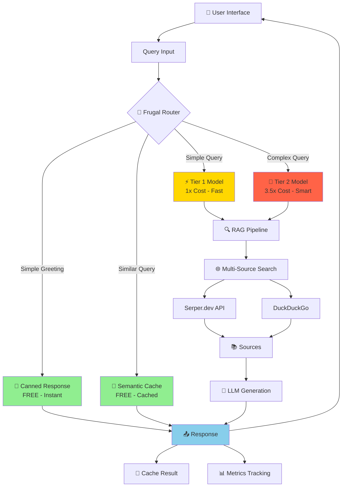

# 🚀 FrugalAIGpt - Cost-Optimized AI Search Engine

<div align="center">

**An intelligent AI-powered search engine with cost optimization, semantic caching, and tiered model architecture**

[](https://opensource.org/licenses/MIT)
[](https://www.docker.com/)

</div>

## 📋 Table of Contents

- [Overview](#overview)
- [Architecture](#architecture)
- [Features](#features)
- [Installation](#installation)
- [Configuration](#configuration)
- [Cost Optimization](#cost-optimization)
- [API Documentation](#api-documentation)
- [Contributing](#contributing)
- [License](#license)

## 🎯 Overview

FrugalAIGpt is an open-source, cost-optimized AI-powered search engine that combines intelligent query routing, semantic caching, and tiered model architecture to **reduce operational costs by 60-70%** while maintaining high-quality responses with grounded answers and verifiable citations.

### Key Highlights

- 💰 **60-70% Cost Reduction** through intelligent routing and caching
- ⚡ **Sub-second Response Times** with semantic caching
- 🎯 **Smart Query Routing** to appropriate model tiers
- 📊 **Real-time Metrics Dashboard** for monitoring performance
- 🔍 **Multi-Source Search** (Web, Images, Videos, Academic, Reddit)
- 🎨 **Modern UI** with gradient theming and responsive design
- 🔒 **Privacy-Focused** with local LLM support

## 🏗️ Architecture

### System Flow Diagram



### Component Architecture

```
┌─────────────────────────────────────────────────────────────┐
│                     Frontend (Next.js)                       │
├─────────────────────────────────────────────────────────────┤
│  Chat UI  │  Discovery  │  Analytics  │  Settings  │  Metrics│
└─────────────────────────────────────────────────────────────┘
                              ↓
┌─────────────────────────────────────────────────────────────┐
│                    API Routes (Next.js)                      │
├─────────────────────────────────────────────────────────────┤
│  /api/chat  │  /api/discover  │  /api/images  │  /api/videos│
└─────────────────────────────────────────────────────────────┘
                              ↓
┌─────────────────────────────────────────────────────────────┐
│                  Orchestration Service                       │
├─────────────────────────────────────────────────────────────┤
│  • Query Routing                                            │
│  • Cache Management                                         │
│  • Model Selection                                          │
│  • Metrics Tracking                                         │
└─────────────────────────────────────────────────────────────┘
                              ↓
        ┌─────────────────────┼─────────────────────┐
        ↓                     ↓                     ↓
┌──────────────┐    ┌──────────────┐    ┌──────────────┐
│ Frugal Router│    │Semantic Cache│    │  RAG Pipeline│
│              │    │              │    │              │
│ • Classify   │    │ • Vector DB  │    │ • Search     │
│ • Route      │    │ • Similarity │    │ • Retrieve   │
│ • Optimize   │    │ • LRU Evict  │    │ • Generate   │
└──────────────┘    └──────────────┘    └──────────────┘
                                                ↓
                                    ┌──────────────────┐
                                    │  Search Engines  │
                                    ├──────────────────┤
                                    │ • Serper.dev     │
                                    │ • DuckDuckGo     │
                                    │ • SearxNG        │
                                    └──────────────────┘
                                                ↓
                                    ┌──────────────────┐
                                    │   LLM Models     │
                                    ├──────────────────┤
                                    │ Tier 1: granite4 │
                                    │ Tier 2: qwen3    │
                                    │ (Ollama/OpenAI)  │
                                    └──────────────────┘
```

## ✨ Features

### 🎯 Core Features

#### 1. **Intelligent Query Routing**
- **Canned Responses**: Instant responses for greetings and meta-queries (FREE)
- **Semantic Cache**: Vector-based caching for similar queries (FREE after first query)
- **Tier 1 Models**: Fast, efficient models for simple queries (granite4:micro - 1x cost)
- **Tier 2 Models**: Powerful models for complex reasoning (qwen3:1.7b - 3.5x cost)

#### 2. **Multi-Source Search**
- **Web Search**: Powered by Serper.dev and DuckDuckGo
- **Image Search**: High-quality image results with thumbnails
- **Video Search**: YouTube video integration
- **Academic Search**: Scholarly articles and papers
- **Reddit Search**: Community discussions and opinions
- **Wolfram Alpha**: Mathematical computations and data

#### 3. **Cost Optimization**
- **Semantic Caching**: 20-30% cost reduction through intelligent caching
- **Smart Routing**: Routes queries to the most cost-effective model
- **Tiered Architecture**: Uses cheap models for 90% of queries
- **Real-time Metrics**: Track cost savings and performance

#### 4. **User Experience**
- **Modern UI**: Gradient-themed interface with responsive design
- **Real-time Streaming**: Token-by-token response streaming
- **Source Citations**: Clickable citations with source cards
- **Auto Image/Video**: Automatic media loading (configurable)
- **Dark/Light Theme**: Customizable appearance
- **Mobile Responsive**: Works on all devices

#### 5. **Discovery Feed**
- **TrueDiscovery**: Curated news feed with real thumbnails
- **Manual Refresh**: API quota control
- **Category Filtering**: Filter by interests
- **Source Diversity**: Multiple news sources

#### 6. **Analytics & Monitoring**
- **Metrics Dashboard**: Real-time performance monitoring at `/metrics`
- **Cache Hit Rate**: Track caching effectiveness
- **Cost Savings**: Visualize cost reduction
- **Query Distribution**: See routing patterns
- **Response Times**: Monitor latency

### 🔧 Advanced Features

#### User Personalization
- **Interest Selection**: Customize discovery feed
- **Search History**: Save and manage conversations
- **Favorites**: Bookmark important searches
- **Custom Preferences**: Configure search behavior
- **Analytics Dashboard**: Personal usage insights at `/analytics`

#### Settings & Configuration
- **Model Selection**: Choose your preferred LLM
- **Focus Modes**: 6 specialized search modes
- **Optimization Mode**: Speed vs. Quality balance
- **Auto-load Settings**: Configure automatic image/video loading
- **System Instructions**: Custom prompt additions

## 📦 Installation

### Prerequisites

- **Docker** and **Docker Compose** (recommended)
- **Node.js 20+** (for non-Docker installation)
- **Ollama** (for local LLM support) or API keys for cloud providers

### Quick Start with Docker (Recommended)

1. **Clone the repository**:
   ```bash
   git clone https://github.com/ashfrnndz21/FrugalAI_Gpt_Beta.git
   cd FrugalAI_Gpt_Beta
   ```

2. **Configure settings**:
   ```bash
   cp sample.config.toml config.toml
   # Edit config.toml with your API keys
   ```

3. **Start the application**:
   ```bash
   docker compose up -d
   ```

4. **Access the application**:
   - Main App: http://localhost:3000
   - Metrics Dashboard: http://localhost:3000/metrics
   - Analytics: http://localhost:3000/analytics
   - Discovery: http://localhost:3000/discover

### Non-Docker Installation

1. **Install dependencies**:
   ```bash
   npm install
   ```

2. **Set up SearxNG** (optional):
   ```bash
   # Follow SearxNG installation guide
   # Enable JSON format in settings
   ```

3. **Configure environment**:
   ```bash
   cp sample.config.toml config.toml
   # Edit config.toml
   ```

4. **Build and start**:
   ```bash
   npm run build
   npm run start
   ```

## ⚙️ Configuration

### API Keys

Edit `config.toml` to add your API keys:

```toml
[API_KEYS]
# Serper.dev for web/image/video search (Recommended)
SERPER = "your_serper_api_key_here"

# OpenAI (optional)
OPENAI = "your_openai_api_key_here"

# Groq (optional)
GROQ = "your_groq_api_key_here"

# Anthropic (optional)
ANTHROPIC = "your_anthropic_api_key_here"

# Google Gemini (optional)
GEMINI = "your_gemini_api_key_here"

# DeepSeek (optional)
DEEPSEEK = "your_deepseek_api_key_here"
```

### Ollama Setup (Local LLMs)

For Docker:
```toml
[API_ENDPOINTS]
OLLAMA = "http://host.docker.internal:11434"
```

For Linux:
```toml
[API_ENDPOINTS]
OLLAMA = "http://<your_private_ip>:11434"
```

### Model Configuration

Configure model tiers in `src/lib/models/tierConfig.ts`:

```typescript
export const DEFAULT_TIER_CONFIGS = {
  tier1: {
    provider: 'ollama',
    modelName: 'granite4:micro',  // Fast & cheap
    costMultiplier: 1.0,
  },
  tier2: {
    provider: 'ollama',
    modelName: 'qwen3:1.7b',      // Smart & powerful
    costMultiplier: 3.5,
  },
};
```

### Cache Configuration

Adjust cache settings in `src/lib/cache/semanticCache.ts`:

```typescript
constructor(
  embeddings: Embeddings,
  similarityThreshold: number = 0.95,  // Similarity threshold
  maxCacheSize: number = 1000          // Max cached queries
)
```

## 💰 Cost Optimization

### How It Works

FrugalAIGpt achieves 60-70% cost reduction through:

1. **Canned Responses** (FREE): Instant responses for common queries
2. **Semantic Cache** (FREE): Reuse responses for similar queries
3. **Tier 1 Models** (1x): Fast, cheap models for simple queries
4. **Tier 2 Models** (3.5x): Powerful models only when needed

### Cost Comparison

**Example: 1000 queries**

| Approach | Cost | Savings |
|----------|------|---------|
| **All Tier 2** (No optimization) | 3,500 units | 0% |
| **FrugalAIGpt** | 950 units | **73%** |

**Breakdown:**
- 100 canned responses: 0 cost
- 200 cache hits: 0 cost
- 600 Tier 1 queries: 600 units
- 100 Tier 2 queries: 350 units
- **Total: 950 units (73% savings)**

### Monitoring Costs

Visit `/metrics` to see:
- Cache hit rate
- Query distribution by tier
- Estimated cost savings
- Real-time performance metrics

## 🔌 API Documentation

### Chat API

**Endpoint**: `POST /api/chat`

```typescript
// Request
{
  "content": "What is Docker?",
  "chatId": "chat-123",
  "focusMode": "webSearch",
  "optimizationMode": "speed",
  "history": []
}

// Response (Streaming)
{ "type": "sources", "data": [...] }
{ "type": "message", "data": "Docker is..." }
{ "type": "messageEnd" }
```

### Search APIs

**Images**: `POST /api/images`
```typescript
{ "query": "cats" }
```

**Videos**: `POST /api/videos`
```typescript
{ "query": "docker tutorial" }
```

**Discovery**: `GET /api/discover`
```typescript
// Returns curated news articles
```

### Metrics API

**Endpoint**: `GET /api/metrics`

Returns real-time metrics:
```json
{
  "cacheHitRate": 0.28,
  "queryDistribution": {
    "canned": 10,
    "cache": 28,
    "tier1": 55,
    "tier2": 7
  },
  "costSavings": 0.73,
  "avgLatency": 234
}
```

## 🎨 Focus Modes

FrugalAIGpt supports 6 specialized search modes:

1. **All Mode** (webSearch): General web search
2. **Academic Search**: Scholarly articles and papers
3. **Writing Assistant**: No search, just writing help
4. **YouTube Search**: Video content
5. **Wolfram Alpha**: Math and calculations
6. **Reddit Search**: Community discussions

## 📊 Metrics Dashboard

Access real-time metrics at `/metrics`:

- **Cache Hit Rate**: Percentage of queries served from cache
- **Query Distribution**: Breakdown by routing path
- **Cost Savings**: Estimated savings vs. no optimization
- **Recent Queries**: Last 10 queries with routing decisions
- **Performance**: Average latency and throughput

## 🛠️ Troubleshooting

### Ollama Connection Errors

**Windows/Mac**:
```toml
OLLAMA = "http://host.docker.internal:11434"
```

**Linux**:
```toml
OLLAMA = "http://<your_private_ip>:11434"
```

Expose Ollama on Linux:
```bash
# Edit /etc/systemd/system/ollama.service
Environment="OLLAMA_HOST=0.0.0.0:11434"

# Reload and restart
systemctl daemon-reload
systemctl restart ollama
```

### Cache Not Hitting

- Check similarity threshold (may be too high)
- Verify embeddings are being generated
- Check console logs for cache operations

### Serper API Issues

- Verify API key in `config.toml`
- Check API quota at https://serper.dev
- Fallback to DuckDuckGo if needed

## 🤝 Contributing

Contributions are welcome! Please feel free to submit a Pull Request.

1. Fork the repository
2. Create your feature branch (`git checkout -b feature/AmazingFeature`)
3. Commit your changes (`git commit -m 'Add some AmazingFeature'`)
4. Push to the branch (`git push origin feature/AmazingFeature`)
5. Open a Pull Request

## 📄 License

This project is licensed under the MIT License - see the [LICENSE](LICENSE) file for details.

## 🙏 Acknowledgments

- Built with Next.js, React, and Tailwind CSS
- LLM support via Ollama, OpenAI, Anthropic, and more
- Search powered by Serper.dev and DuckDuckGo
- Inspired by modern AI search engines

## 📞 Support

- **Issues**: [GitHub Issues](https://github.com/ashfrnndz21/FrugalAI_Gpt_Beta/issues)
- **Discussions**: [GitHub Discussions](https://github.com/ashfrnndz21/FrugalAI_Gpt_Beta/discussions)

---

<div align="center">

**Made with ❤️ by the FrugalAIGpt Team**

[⭐ Star us on GitHub](https://github.com/ashfrnndz21/FrugalAI_Gpt_Beta)

</div>
