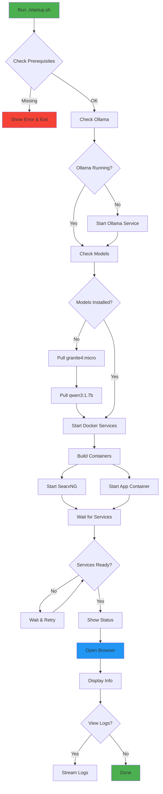
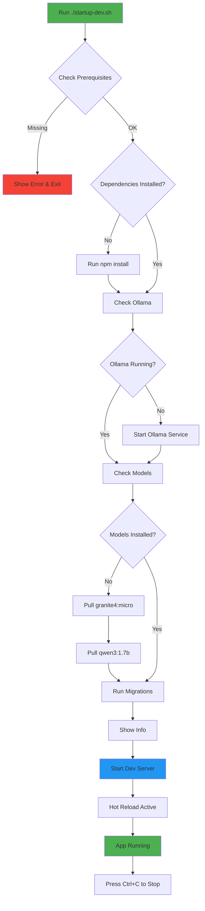
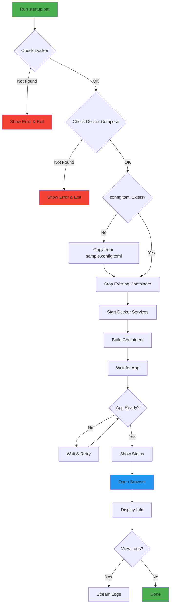

# 🔄 FrugalAIGpt Startup Flow

Visual guide to understand what happens when you start FrugalAIGpt.

## 🚀 Production Startup Flow (`startup.sh`)



## 💻 Development Startup Flow (`startup-dev.sh`)



## 🪟 Windows Startup Flow (`startup.bat`)



## 🔍 Detailed Component Startup

### 1. Prerequisites Check

```
┌─────────────────────────────────────┐
│   Checking Prerequisites            │
├─────────────────────────────────────┤
│ ✓ Docker / Node.js                  │
│ ✓ Docker Compose / npm              │
│ ✓ Ollama (optional)                 │
│ ✓ config.toml                       │
│ ✓ Dependencies (dev mode)           │
└─────────────────────────────────────┘
```

### 2. Ollama Service

```
┌─────────────────────────────────────┐
│   Starting Ollama                   │
├─────────────────────────────────────┤
│ 1. Check if running                 │
│ 2. Start service if needed          │
│ 3. Wait for API (localhost:11434)  │
│ 4. Verify connectivity              │
└─────────────────────────────────────┘
```

### 3. Model Management

```
┌─────────────────────────────────────┐
│   Pulling AI Models                 │
├─────────────────────────────────────┤
│ 1. Check granite4:micro (~1GB)      │
│    └─ Pull if missing               │
│ 2. Check qwen3:1.7b (~1GB)          │
│    └─ Pull if missing               │
└─────────────────────────────────────┘
```

### 4. Docker Services (Production)

```
┌─────────────────────────────────────┐
│   Starting Docker Services          │
├─────────────────────────────────────┤
│ 1. Stop existing containers         │
│ 2. Build app image                  │
│ 3. Start SearxNG (port 4000)        │
│ 4. Start App (port 3000)            │
│ 5. Create network & volumes         │
└─────────────────────────────────────┘
```

### 5. Development Server (Dev Mode)

```
┌─────────────────────────────────────┐
│   Starting Dev Server               │
├─────────────────────────────────────┤
│ 1. Run database migrations          │
│ 2. Start Next.js dev server         │
│ 3. Enable hot reload                │
│ 4. Watch for file changes           │
└─────────────────────────────────────┘
```

### 6. Health Checks

```
┌─────────────────────────────────────┐
│   Waiting for Services              │
├─────────────────────────────────────┤
│ 1. Poll http://localhost:3000       │
│ 2. Retry every 2 seconds            │
│ 3. Max 60 attempts (2 minutes)      │
│ 4. Report status                    │
└─────────────────────────────────────┘
```

## ⏱️ Typical Startup Times

### First Run (Cold Start)
```
┌──────────────────────────────────────────┐
│ Component              Time               │
├──────────────────────────────────────────┤
│ Prerequisites Check    5-10 seconds       │
│ Ollama Start          10-20 seconds       │
│ Model Pull (both)     5-10 minutes        │
│ Docker Build          2-5 minutes         │
│ Service Start         10-30 seconds       │
├──────────────────────────────────────────┤
│ TOTAL                 8-16 minutes        │
└──────────────────────────────────────────┘
```

### Subsequent Runs (Warm Start)
```
┌──────────────────────────────────────────┐
│ Component              Time               │
├──────────────────────────────────────────┤
│ Prerequisites Check    2-5 seconds        │
│ Ollama Check          1-2 seconds         │
│ Model Check           1-2 seconds         │
│ Docker Start          10-20 seconds       │
│ Service Ready         5-10 seconds        │
├──────────────────────────────────────────┤
│ TOTAL                 20-40 seconds       │
└──────────────────────────────────────────┘
```

### Development Mode
```
┌──────────────────────────────────────────┐
│ Component              Time               │
├──────────────────────────────────────────┤
│ Prerequisites Check    2-5 seconds        │
│ Ollama Check          1-2 seconds         │
│ Model Check           1-2 seconds         │
│ Migrations            1-2 seconds         │
│ Dev Server Start      5-10 seconds        │
├──────────────────────────────────────────┤
│ TOTAL                 10-20 seconds       │
└──────────────────────────────────────────┘
```

## 🎯 What Happens After Startup

```
┌─────────────────────────────────────────────────────┐
│                                                     │
│  ✅ FrugalAIGpt is Running!                        │
│                                                     │
│  📍 Access Points:                                 │
│     • Main App:    http://localhost:3000           │
│     • Metrics:     http://localhost:3000/metrics   │
│     • Analytics:   http://localhost:3000/analytics │
│     • Discovery:   http://localhost:3000/discover  │
│                                                     │
│  🤖 Services Running:                              │
│     • Next.js App (port 3000)                      │
│     • SearxNG (port 4000) [Docker only]            │
│     • Ollama (port 11434)                          │
│                                                     │
│  💾 Data Persistence:                              │
│     • SQLite Database (./data/)                    │
│     • Uploaded Files (./uploads/)                  │
│     • Docker Volumes [Docker only]                 │
│                                                     │
└─────────────────────────────────────────────────────┘
```

## 🔄 Restart Flow

### Quick Restart (Docker)
```bash
docker compose restart
# ~10 seconds
```

### Full Restart (Docker)
```bash
docker compose down
docker compose up -d
# ~30 seconds
```

### Rebuild (Docker)
```bash
docker compose down
docker compose up -d --build
# ~2-5 minutes
```

### Development Restart
```bash
# Press Ctrl+C
./startup-dev.sh
# ~10-20 seconds
```

## 🛑 Shutdown Flow

### Docker Mode
```
docker compose down
    ↓
Stop App Container
    ↓
Stop SearxNG Container
    ↓
Remove Network
    ↓
Keep Volumes (data persists)
    ↓
Done
```

### Development Mode
```
Press Ctrl+C
    ↓
Stop Next.js Server
    ↓
Cleanup Processes
    ↓
Done
```

## 💡 Tips for Faster Startups

1. **Keep Ollama Running**: Don't stop Ollama between sessions
2. **Use Dev Mode**: Faster iteration during development
3. **Pre-pull Models**: Pull models once, use forever
4. **Keep Docker Running**: Don't quit Docker Desktop
5. **Use SSD**: Faster container and model loading
6. **Allocate RAM**: Give Docker 4GB+ RAM for best performance

## 🆘 Troubleshooting Startup Issues

### Startup Hangs
```
1. Check Docker is running
2. Check ports 3000, 4000, 11434 are free
3. Check disk space (need ~5GB)
4. Check RAM (need ~4GB)
5. View logs: docker compose logs -f
```

### Models Won't Pull
```
1. Check internet connection
2. Check Ollama is running
3. Check disk space
4. Pull manually: ollama pull granite4:micro
```

### Services Won't Start
```
1. Check prerequisites
2. Check config.toml exists
3. Check ports are available
4. Try: docker compose down && docker compose up -d
```

---

**Understanding the startup flow helps troubleshoot issues faster! 🚀**

---
*Last updated: October 19, 2025*
